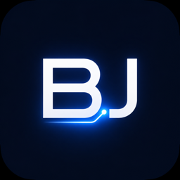

<p align="center">
  
</p>

<h1 align="center">BJ LED Ambilight</h1>

<p align="center">
  Native screen-reactive lighting for BJ_LED Bluetooth strips.
</p>

<p align="center">
  <a href="https://github.com/alman790/bj-led-screen-sync/actions/workflows/ci.yml"></a>
  <a href="https://github.com/alman790/bj-led-screen-sync/releases"></a>
  
  
  
  
</p>

<p align="center">
  
  
  
  
</p>

BJ LED Ambilight syncs a `BJ_LED` / `BJ_LED_M` Bluetooth LED strip with the
colors on your screen. It captures a downscaled frame in memory, analyzes the
screen edges and corners, and sends compact RGB updates to the strip over
Bluetooth LE.

## Features

- Native app builds for macOS, Windows, and Linux.
- Cross-platform C++20 color pipeline and BJ_LED packet generation.
- Zoned screen analysis using edges and corners instead of a single flat average.
- Auto mode for live screen-reactive lighting.
- Manual red, green, blue, and white output modes.
- FPS, brightness, saturation, smoothing, threshold, and 127/255 channel controls.
- Low-resolution in-memory sampling designed to keep CPU and memory use small.
- No screenshot files are written during live capture.

## Install

Download the latest build from
[GitHub Releases](https://github.com/alman790/bj-led-screen-sync/releases/latest).

macOS and Linux can install from the release script:

```bash
curl -fsSL https://raw.githubusercontent.com/alman790/bj-led-screen-sync/main/scripts/install.sh | bash
```

Windows can install from PowerShell:

```powershell
iwr https://raw.githubusercontent.com/alman790/bj-led-screen-sync/main/scripts/install-windows.ps1 -UseB | iex
```

## Platform Support

| Platform | Status | Capture | Bluetooth |
| --- | --- | --- | --- |
| macOS | Supported | CoreGraphics display stream | CoreBluetooth |
| Windows | Supported | Win32 / GDI virtual desktop capture | Native WinRT BLE advertisement scan and GATT writes |
| Linux | Supported | X11 / XWayland virtual desktop capture | BlueZ |

The app uses the same shared color pipeline on every platform. Platform-specific
code is isolated under `src/macos`, `src/platform/windows`, and
`src/platform/linux`.

## Platform Notes

- macOS requires Screen Recording and Bluetooth permissions.
- Windows scans BLE advertisements and connects by address. Normal Windows
  Bluetooth pairing is not required for the primary path.
- Linux requires X11 or XWayland, BlueZ, D-Bus access, and a powered Bluetooth
  adapter. If scan cannot see the strip, check that `bluetooth.service` is
  running, the adapter is powered on, `rfkill` is unblocked, and your user has
  Bluetooth permissions where the distro requires a `bluetooth` group.

## Manual Validation

Windows:

```text
Scan -> BJ_LED candidate appears with address/RSSI
Connect -> strip ready
Red / Green / Blue / White -> strip color changes
Auto -> live screen colors write without freezing the UI
```

Linux under X11 or XWayland:

```text
Scan -> BJ_LED candidate appears with address/RSSI
Connect -> GATT services resolve
Red / Green / Blue / White -> strip color changes
Auto -> live screen colors write without freezing the UI
```

## Security Note

Windows antivirus tools can warn about new unsigned installers or portable
builds, especially before a release has reputation history. The project does not
include malware: the source is public, release artifacts are built by GitHub
Actions, and checksums are published with each release.

## LED Protocol

The current BJ_LED protocol support writes one RGB color to the strip:

```text
Characteristic: 0000ee01-0000-1000-8000-00805f9b34fb
Packet:         69 96 05 02 RR GG BB WW
```

The app computes separate edge and corner colors internally. Multi-zone strip
output will require a confirmed segmented or addressable BJ_LED protocol.

## Project Layout

```text
src/lib/bj_core.hpp                  shared RGB type, color analysis, packet format
src/macos/                           macOS AppKit, capture, and Bluetooth backend
src/platform/linux/                  Linux capture and BlueZ backend
src/platform/windows/                Windows UI, capture, and Bluetooth backend
src/resources/                       app icons and macOS bundle resources
tests/                               core unit tests
```

## Resource Model

- Pixel storage uses `union bj::RGB`.
- `sizeof(bj::RGB) == 4` is enforced at compile time.
- Default sample buffer: `160 x 90 x 4`, about 57 KB.
- Bluetooth writes use fixed 8-byte packets.
- Live capture uses memory buffers only.

## Development

```bash
make test
make coverage
make lint
```

Tests run in CI on every push and pull request. The shared core has an enforced
99% line coverage gate.

See [CONTRIBUTING.md](CONTRIBUTING.md) for contribution rules and platform
validation notes.

## License

MIT. See [LICENSE](LICENSE).
